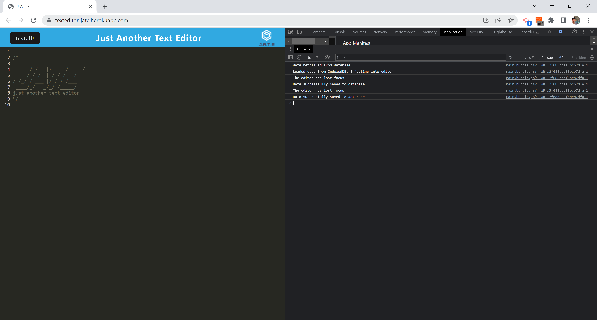
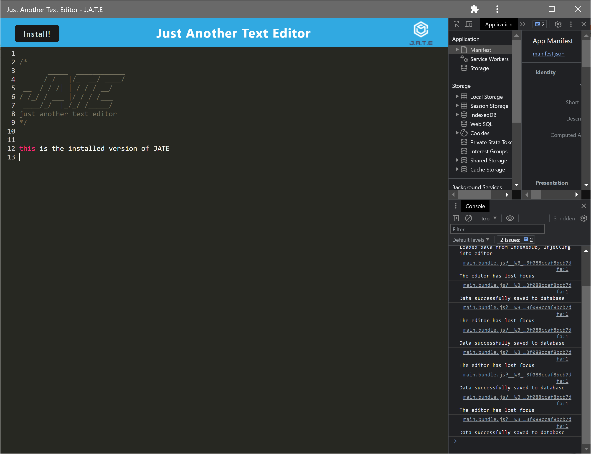
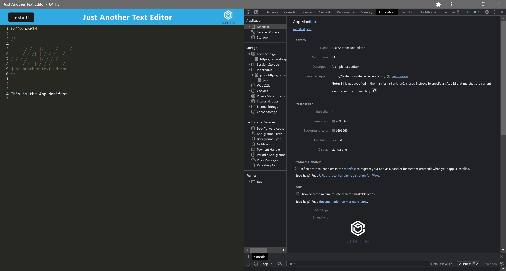
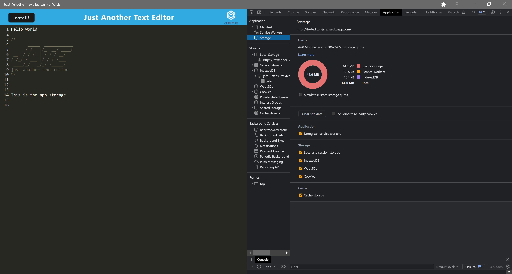

# J.A.T.E (Just Another Text Editor)

## Table of Contents
---
* [Installation](#installation)
* [Packages](#packages)
* [Description](#description)
* [Usage](#usage)
* [License](#license)
* [Contributing](#contributing)
* [Tests](#tests)
* [Questions](#questions)

 

## Installation

`git clone` the repo to your local machine. To use this application, run the following command to install the dependencies: 

     npm install

Then run the following command:

`npm run start`

 

## Packages
 

General Technologies:

 

 

 

 

NPM packages:
 

 

 

 

- workbox-strategies ^7.0.0
 
 

## Description
Just Another Text Editor (J.A.T.E) is a simple text editor that can be utilized both off and online. This application stores data in the indexedDB database as well as the local storage with the indexedDB being the first option when loading the application. If offline use is desired, the application can be downloaded to your desktop.

## Usage

To use this app go to the link provided below. For offline use, go to the link and hit the "install" button to install the app locally, for offline use.

One can also clone this repository, run npm install and npm run start=dev

## Screenshots

 

 

## License 
---
[MIT License](./LICENSE)  

This application is covered by the MIT license.

 

## Contributing 
---
This project was completed by myself, Alicia Keberle, as part of the University of Oregon Full Stack Development Bootcamp. If you would like to contribute, i am always looking for ways to ameliorate my projects.
 

## License 
---
[MIT License](./LICENSE)  

This application is covered by the MIT license.

 

## Questions?
---
Please contact me on Github at [keberlea](https://github.com/keberlea) or by [email](mailto:alicia.keberle@gmail.com).
